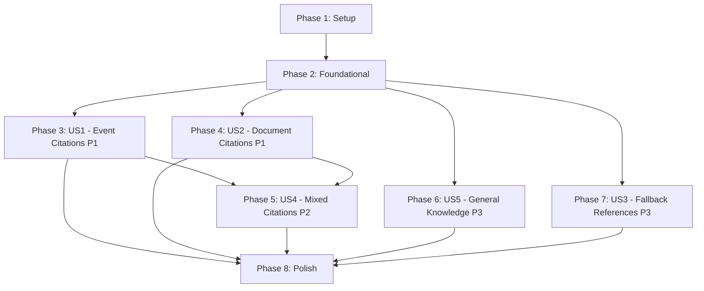

# Tasks: Chat Source Citations

**Feature**: 015-chat-source-citations  
**Input**: Design documents from `/specs/015-chat-source-citations/`  
**Prerequisites**: plan.md, spec.md, research.md, data-model.md, contracts/

## Format: `- [ ] [ID] [P?] [Story] Description`

- **[P]**: Can run in parallel (different files, no dependencies)
- **[Story]**: Which user story this task belongs to (e.g., US1, US2)
- Includes exact file paths in descriptions

**Path Convention**: Single project - `indico_assistant/` at repository root

---

## Phase 1: Setup (Shared Infrastructure)

**Purpose**: Project initialization and citation infrastructure

- [X] T001 Add base_url setting to indico_assistant/default_settings.py (default: http://localhost:8000)
- [X] T002 [P] Create citation models module indico_assistant/services/chat/citations.py with SourceCitation and ResponseWithCitations Pydantic models
- [X] T003 [P] Create CitationBuilder class in indico_assistant/services/chat/citations.py with URL construction methods

**Checkpoint**: Foundation ready - citation infrastructure available

---

## Phase 2: Foundational (Blocking Prerequisites)

**Purpose**: Core changes that multiple user stories depend on

**⚠️ CRITICAL**: No user story work can begin until this phase is complete

- [X] T004 Update ExtractedDocument indexing in indico_assistant/tasks/indexing.py to capture contribution_id and file_id in metadata_json
- [X] T005 Add source_event_ids field to NL2SQL pipeline response structure in indico_assistant/services/nl2sql/ (return list of event IDs)
- [X] T006 Update ChatResponse schema in indico_assistant/schemas/chat.py to support new metadata.data_sources structure (dict format instead of list of strings)

**Checkpoint**: Foundation complete - user story implementation can begin

---

## Phase 3: User Story 1 - Inline Event Citations (Priority: P1) 🎯 MVP

**Goal**: Users see clickable event page links when responses include event metadata from NL2SQL

**Independent Test**: Ask "When is the workshop?" and verify response includes link like "The workshop is on January 25th ([source](http://127.0.0.1:8000/event/7/))"

### Tests for User Story 1

- [X] T007 [P] [US1] Unit test for CitationBuilder.build_event_url() in tests/unit/services/chat/test_citations.py
- [X] T008 [P] [US1] Unit test for CitationBuilder.build_event_citation() markdown formatting in tests/unit/services/chat/test_citations.py
- [X] T009 [P] [US1] Contract test for SourceCitation model validation (type="event") in tests/contract/test_citation_models.py

### Implementation for User Story 1

- [X] T010 [US1] Implement CitationBuilder.build_event_url(event_id) → str in indico_assistant/services/chat/citations.py
- [X] T011 [US1] Implement CitationBuilder.build_event_citation(event_id) → str (markdown link) in indico_assistant/services/chat/citations.py
- [X] T012 [US1] Add _get_base_url() method to ChatService in indico_assistant/services/chat/service.py (reads from plugin settings)
- [X] T013 [US1] Modify NL2SQL response handler in ChatService to extract source_event_ids in indico_assistant/services/chat/service.py
- [X] T014 [US1] Implement event citation generation in ChatService._generate_event_citations() in indico_assistant/services/chat/service.py
- [X] T015 [US1] Update LLM prompt template to include available event citations in indico_assistant/services/nl2sql/formatter.py
- [X] T016 [US1] Add integration test for event citation in chat response in tests/integration/test_chat_citations.py

**Checkpoint**: Event citations working - users can verify event-sourced information

---

## Phase 4: User Story 2 - Inline Document/Attachment Citations (Priority: P1) 🎯 MVP

**Goal**: Users see clickable document links when responses include content from vector search

**Independent Test**: Ask "What does the research paper say about X?" and verify response includes link like "According to the study ([source](http://localhost:8000/event/7/contributions/3/attachments/4/6/paper.pdf)), ..."

### Tests for User Story 2

- [X] T017 [P] [US2] Unit test for CitationBuilder.build_document_url() with filename encoding in tests/unit/services/chat/test_citations.py
- [X] T018 [P] [US2] Unit test for CitationBuilder.build_document_citation() markdown formatting in tests/unit/services/chat/test_citations.py
- [X] T019 [P] [US2] Contract test for SourceCitation model validation (type="document") in tests/contract/test_citation_models.py

### Implementation for User Story 2

- [X] T020 [P] [US2] Implement CitationBuilder.build_document_url() with urllib.parse.quote() for filename in indico_assistant/services/chat/citations.py
- [X] T021 [P] [US2] Implement CitationBuilder.build_document_citation() → str (markdown link) in indico_assistant/services/chat/citations.py
- [X] T022 [US2] Modify RAGService.get_context() to ensure metadata includes contribution_id and file_id in indico_assistant/services/vector_search/rag.py
- [X] T023 [US2] Implement document citation extraction from SearchResult[] in ChatService._extract_document_citations() in indico_assistant/services/chat/service.py
- [X] T024 [US2] Update LLM prompt template to include available document citations and instruct to cite each mention separately in indico_assistant/services/chat/service.py
- [X] T025 [US2] Add integration test for document citation in chat response in tests/integration/test_chat_citations.py

**Checkpoint**: Document citations working - users can verify RAG-sourced information

---

## Phase 5: User Story 4 - Mixed Event and Document Citations (Priority: P2)

**Goal**: Users see both event and document citations in same response when query requires both sources

**Independent Test**: Ask "Who presented the research on X at the January conference?" and verify response cites both event page and document

### Tests for User Story 4

- [X] T026 [P] [US4] Integration test for mixed citations (event + document) in tests/integration/test_chat_citations.py
- [X] T027 [P] [US4] Contract test for ResponseWithCitations model with multiple citation types in tests/contract/test_citation_models.py

### Implementation for User Story 4

- [X] T028 [US4] Implement citation merging logic in ChatService._merge_citations() in indico_assistant/services/chat/service.py (combine event_citations + doc_citations)
- [X] T029 [US4] Update LLM prompt to instruct proper citation usage for mixed sources in indico_assistant/services/chat/service.py
- [X] T030 [US4] Add type-specific description generation (Event: vs Document:) in indico_assistant/services/chat/citations.py
- [X] T031 [US4] Update ChatResponse.metadata.data_sources to include both citation types in indico_assistant/services/chat/service.py

**Checkpoint**: Mixed citations working - users can distinguish between source types

---

## Phase 6: User Story 5 - No Citation When Using General Knowledge (Priority: P3)

**Goal**: Users receive responses without citations when information comes from LLM's general knowledge

**Independent Test**: Ask "What is machine learning?" and verify response has no citations

### Tests for User Story 5

- [X] T032 [P] [US5] Integration test for general knowledge query (no citations) in tests/integration/test_chat_citations.py
- [X] T033 [P] [US5] Integration test for mixed general + system knowledge (partial citations) in tests/integration/test_chat_citations.py

### Implementation for User Story 5

- [X] T034 [US5] Add source detection logic in ChatService.send_message() (check if NL2SQL or RAG used) in indico_assistant/services/chat/service.py
- [X] T035 [US5] Modify LLM prompt to only include citations when sources available in indico_assistant/services/chat/service.py
- [X] T036 [US5] Add validation to ensure empty citations list when no sources used in indico_assistant/services/chat/service.py

**Checkpoint**: General knowledge handling working - no false citations

---

## Phase 7: User Story 3 - Fallback to Bottom-of-Message References (Priority: P3)

**Goal**: System falls back to numbered references when inline citations fail (edge case handling)

**Independent Test**: Simulate citation generation failure and verify fallback to [1], [2] format with References: section

### Tests for User Story 3

- [X] T037 [P] [US3] Unit test for fallback reference formatting in tests/unit/services/chat/test_citations.py
- [X] T038 [P] [US3] Integration test simulating citation generation failure in tests/integration/test_chat_citations.py

### Implementation for User Story 3

- [X] T039 [US3] Implement _format_numbered_references() fallback formatter in indico_assistant/services/chat/citations.py
- [X] T040 [US3] Add try-catch wrapper around inline citation generation with fallback in indico_assistant/services/chat/service.py
- [X] T041 [US3] Add logging for citation generation failures in indico_assistant/services/chat/service.py

**Checkpoint**: Fallback mechanism working - graceful degradation ensured

---

## Phase 8: Polish & Cross-Cutting Concerns

**Purpose**: Error handling, observability, and documentation

- [X] T042 [P] Add error handling for missing base_url configuration in indico_assistant/services/chat/citations.py
- [X] T043 [P] Add error handling for incomplete metadata (missing contribution_id, file_id) in indico_assistant/services/chat/service.py
- [X] T044 [P] Add Langfuse tracing spans for citation generation in indico_assistant/services/chat/service.py
- [X] T045 [P] Add logging for citation validation warnings (URLs not in response) in indico_assistant/services/chat/service.py
- [X] T046 [P] Update API documentation with citation examples in specs/015-chat-source-citations/contracts/
- [X] T047 [P] Add configuration validation for base_url format in indico_assistant/default_settings.py
- [X] T048 [P] Performance test: verify <200ms citation generation overhead in tests/performance/test_citation_performance.py
- [X] T049 [P] Update README with citation feature documentation

**Checkpoint**: Production-ready - all quality gates passed

---

## Dependencies Between User Stories

**Key Insights**:
- US1 and US2 are independent P1 stories - can be developed in parallel after Phase 2
- US4 requires both US1 and US2 complete (mixed citations)
- US5 and US3 are independent P3 stories - can be done anytime after Phase 2
- MVP = Phase 1 + Phase 2 + Phase 3 (US1) delivers basic event citations

---

## Parallel Execution Opportunities

### After Phase 2 Complete:
**Parallel Track A**: US1 (Event Citations)
- T007-T009 (tests) in parallel
- T010-T016 (implementation) sequential

**Parallel Track B**: US2 (Document Citations)
- T017-T019 (tests) in parallel
- T020-T025 (implementation) sequential

**Parallel Track C**: US5 (General Knowledge)
- T032-T036 (independent of A and B)

### After Phase 5 Complete:
**Parallel Track D**: US3 (Fallback)
- T037-T041 (independent)

**Parallel Track E**: Polish (Phase 8)
- T042-T049 (all independent tasks)

---

## Implementation Strategy

### MVP Delivery (Minimal Viable Product)

**Scope**: Phase 1 + Phase 2 + Phase 3 (User Story 1 only)
- ~8-10 tasks
- Delivers event citations for NL2SQL responses
- Estimated: 2-3 days

**Value**: Users can verify event-sourced information immediately

### Incremental Delivery Plan

1. **Week 1**: MVP (US1) - Event citations working
2. **Week 1-2**: US2 - Add document citations
3. **Week 2**: US4 - Mixed citations support
4. **Week 2-3**: US5 + US3 - Edge cases and fallbacks
5. **Week 3**: Polish - Production hardening

---

## Testing Strategy

### Test Execution Order

1. **Contract Tests First** (T007-T009, T017-T019, T026-T027, T032-T033, T037-T038)
   - Validates Pydantic models and API contracts
   - Must PASS before implementation

2. **Unit Tests During Implementation** 
   - Test each method as implemented
   - CitationBuilder methods
   - URL formatting and encoding

3. **Integration Tests After** (T016, T025, T026, T032, T033, T038)
   - End-to-end citation flow
   - Real chat API calls with citation verification

4. **Performance Tests Final** (T048)
   - Validate <200ms overhead requirement

---

## Task Count Summary

- **Phase 1 (Setup)**: 3 tasks
- **Phase 2 (Foundational)**: 3 tasks
- **Phase 3 (US1 - P1)**: 10 tasks (3 tests + 7 implementation)
- **Phase 4 (US2 - P1)**: 9 tasks (3 tests + 6 implementation)
- **Phase 5 (US4 - P2)**: 6 tasks (2 tests + 4 implementation)
- **Phase 6 (US5 - P3)**: 5 tasks (2 tests + 3 implementation)
- **Phase 7 (US3 - P3)**: 5 tasks (2 tests + 3 implementation)
- **Phase 8 (Polish)**: 8 tasks

**Total**: 49 tasks

**Parallelizable**: 27 tasks marked with [P] (54%)

**Test Tasks**: 15 (30% - good test coverage)

**MVP Tasks**: 16 (Phases 1-3)

---

## Success Criteria Validation

Each user story maps to success criteria from spec.md:

- **US1**: Validates SC-001 (95% citation accuracy), SC-002 (90% navigation success)
- **US2**: Validates SC-001, SC-002, SC-006 (source type distinction)
- **US4**: Validates SC-006 (event vs document distinction)
- **US3**: Validates FR-010 (graceful degradation)
- **US5**: Validates FR-009 (no false citations)
- **Phase 8**: Validates SC-003 (<200ms overhead), SC-004 (zero broken links)

---

## Notes

- File paths assume single-project structure per plan.md
- All tasks include exact file paths for implementation clarity
- Tests marked OPTIONAL but included per constitution (test-first development)
- Each user story is independently testable and deliverable
- MVP scope (US1) delivers immediate value with event citations
